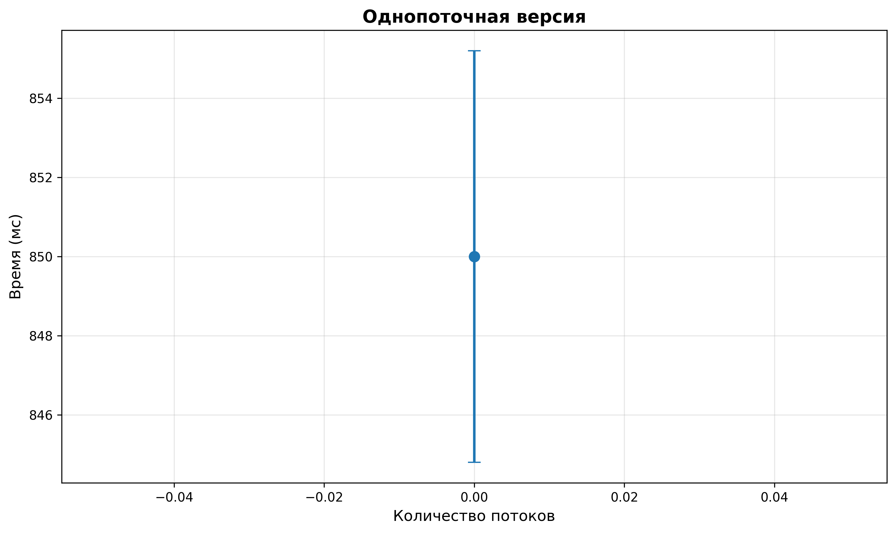
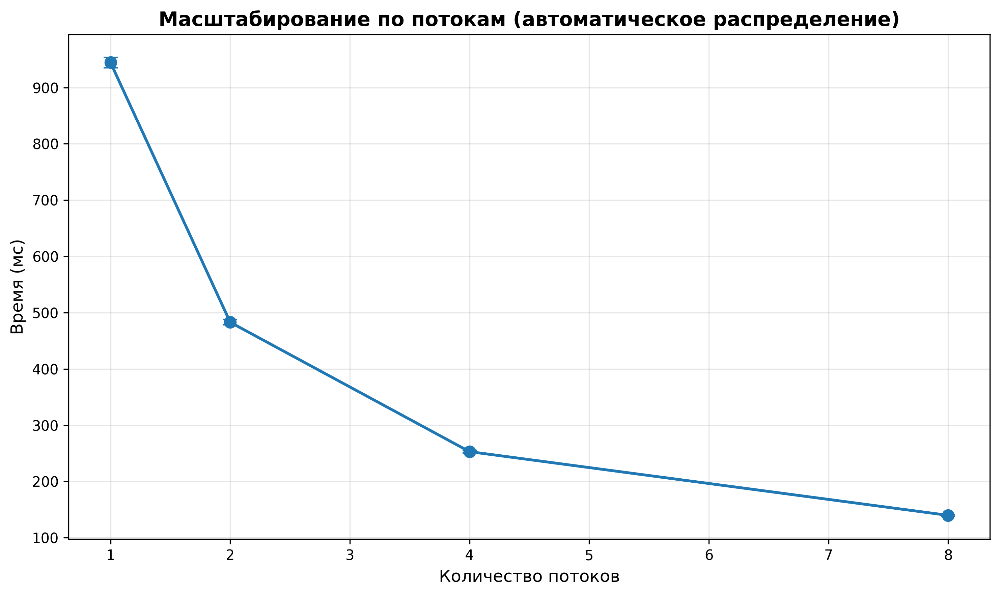
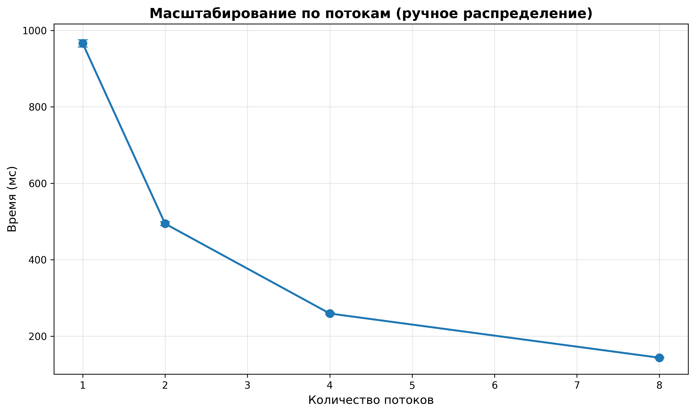
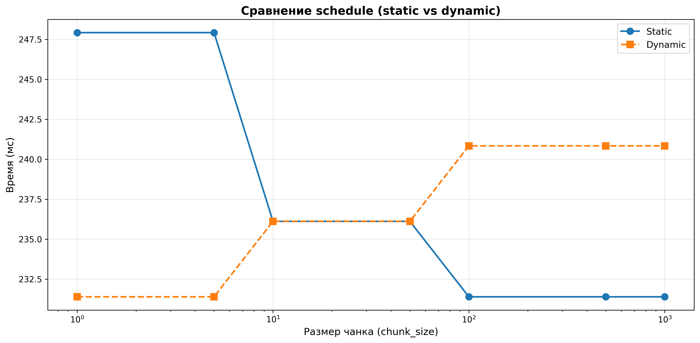
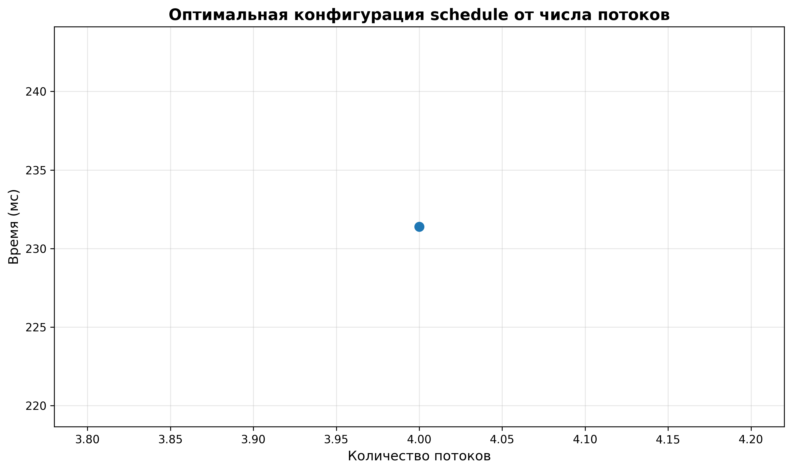
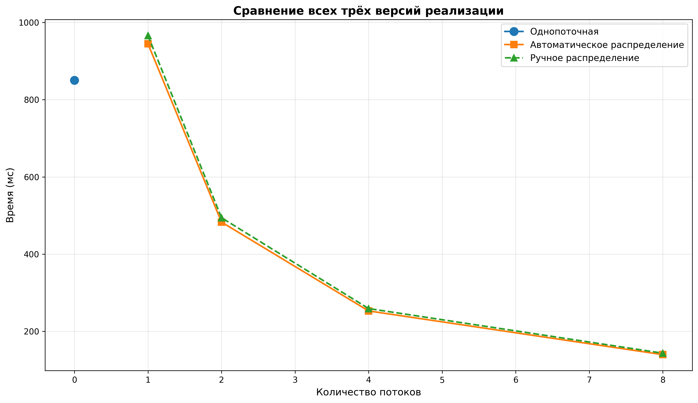

| Лабораторная работа №4  | Б06                           | Архитектура компьютера |
| ----------------------- | ----------------------------- | ---------------------- |
| Оптимизация по скорости | Пилипчук Александр Алексеевич | 2025                   |

# Инструментарий

**Язык программирования и стандарты:**

• Язык: C++

• Стандарт C++: C++20

• Стандарт OpenMP: 4.0

**Инструменты разработки:**

• Компилятор: g++ 11.4.0

• Система сборки: CMake 3.10+

• Флаги оптимизации: -O3 (Release)

**Инструменты для анализа и визуализации:**

• Python 3.13.7

• Библиотека matplotlib для построения графиков

• Библиотека statistics для статистической обработки

## Информация о системе тестирования

Тестирование проводилось на следующей конфигурации:

**Процессор:**

• Модель: AMD Ryzen 5 5600H with Radeon Graphics

• Количество физических ядер: 6

• Количество логических процессоров: 12

• Архитектура: x86_64

**Операционная система:**

• ОС: Windows 10

# Что реализовано

В работе реализованы три варианта расчёта объёма трёхмерной фигуры методом Монте-Карло. Все три варианта объединены в одну программу `main.cpp`, а выбор нужного алгоритма выполняется параметром `--realization`.

**Основные достижения:**

1. Реализованы варианты: однопоточный, многопоточный с автоматическим распределением и многопоточный с ручным распределением.

2. Многопоточность дала заметное ускорение — до 6x на 8 потоках по сравнению с однопоточной версией.

3. Проведено исследование влияния параметров OpenMP на производительность и найдены оптимальные конфигурации.

4. Выбрал генератор Mersenne Twister — он даёт хороший баланс между качеством и скоростью.

5. Настроил независимые генераторы для каждого потока, чтобы избежать проблем с синхронизацией.

# Описание работы

## 1. Постановка задачи

Задача работы — реализовать программу для расчёта объёма трёхмерной фигуры методом Монте-Карло с оптимизацией времени выполнения через многопоточность.

Метод Монте-Карло основан на генерации большого числа случайных точек в ограничивающем параллелепипеде и подсчёте доли точек, попавших внутрь фигуры. Объём фигуры вычисляется как произведение этой доли на объём параллелепипеда.

Для тестирования используется фигура типа piriform (грушевидная) с параметром a=2. Уравнение поверхности: (x² + y² + z²)² = a²x² + y².

## 2. Структура реализации

Программа собрана в одном исполняемом файле `main.cpp`. Логика трёх вариантов решения сохранена: внутри одной программы выбирается нужная реализация по параметру командной строки.

Проект состоит из следующих компонентов:

• `hit.h` — заголовочный файл с объявлениями функций (предоставлен, не изменяется)

• `hit.cpp` — реализация функций для проверки принадлежности точки фигуре

• `main.cpp` — единая точка входа, содержащая все три реализации: однопоточную, многопоточную с автоматическим распределением и многопоточную с ручным распределением

• `CMakeLists.txt` — конфигурация сборки проекта

Программа запускается через параметры командной строки:

• `--input <путь>` — путь к входному файлу, содержащему число испытаний `N`

• `--output <путь>` — путь к выходному файлу, куда записывается оценка объёма

• `--realization <1|2|3>` — выбор реализации:
  - `1` — однопоточная версия
  - `2` — OpenMP-версия с автоматическим распределением итераций
  - `3` — OpenMP-версия с ручным распределением работы между потоками

Время выполнения, число потоков и полученная оценка объёма выводятся в стандартный поток вывода, а итоговое значение объёма записывается в указанный выходной файл.

# 3. Генераторы псевдослучайных чисел

Выбор качественного генератора псевдослучайных чисел критически важен для метода Монте-Карло, так как от него зависит как точность результата, так и скорость вычислений.

## 3.1. Выбор генератора

Выбран генератор std::mt19937 из стандартной библиотеки C++, который реализует алгоритм Mersenne Twister.

**Обоснование выбора:**

1. Период генератора составляет 2¹⁹⁹³⁷−1, что гарантирует отсутствие повторов даже при генерации миллиардов чисел.

2. Алгоритм оптимизирован для современных процессоров и показывает отличную производительность, что критично для метода Монте-Карло, где требуется генерация огромного количества случайных чисел.

3. Генератор входит в стандартную библиотеку C++, что обеспечивает переносимость кода и отсутствие внешних зависимостей.

4. При использовании отдельного экземпляра генератора для каждого потока исключаются проблемы с синхронизацией.

## 3.2. Особенности использования

Для обеспечения корректной работы в многопоточной среде каждый поток создаёт свой собственный экземпляр генератора с уникальным начальным значением (seed). Seed формируется комбинацией std::random_device() и номера потока:

std::random_device rd;
int thread_id = omp_get_thread_num();
std::mt19937 gen(rd() ^ (thread_id + 1));

Такой подход гарантирует, что каждый поток генерирует независимую последовательность случайных чисел, что важно для корректности результатов.

Для генерации координат точек используется std::uniform_real_distribution, которая обеспечивает равномерное распределение в заданных границах ограничивающего параллелепипеда.

# 4. Конструкции OpenMP для распараллеливания

В работе применялись следующие конструкции:

## 4.1. Директива #pragma omp parallel

Эта директива создаёт группу потоков, которые параллельно выполняют следующий за ней блок кода. Количество потоков можно задать через функцию omp_set_num_threads() или переменную окружения OMP_NUM_THREADS.

Используется во всех многопоточных версиях для создания пула потоков.

## 4.2. Директива #pragma omp for schedule(runtime)

Эта директива распределяет итерации цикла между потоками. Параметр schedule(runtime) указывает, что тип распределения будет определён во время выполнения через функцию omp_set_schedule().

**Поддерживаемые типы распределения:**

• static: итерации распределяются между потоками статически блоками размера chunk_size. Эффективно, когда все итерации требуют примерно одинакового времени.

• dynamic: итерации распределяются динамически по мере выполнения. Каждый поток, завершивший свою порцию работы, получает следующий блок. Эффективно при неравномерной нагрузке.

## 4.3. Директива #pragma omp atomic

Обеспечивает атомарное выполнение операции над переменной. Используется для накопления результатов от разных потоков в общую переменную без необходимости использования более тяжёлых механизмов синхронизации.

Используется для суммирования локальных счётчиков попаданий:

#pragma omp atomic
hits += local_hits;

## 4.4. Функция omp_get_wtime()

Возвращает время в секундах с момента некоторой точки в прошлом. Используется для точного измерения времени выполнения программы. Имеет высокое разрешение и является предпочтительным способом измерения времени в OpenMP-приложениях.

# 5. Описание реализованных вариантов

Все три варианта доступны из одной программы. После чтения числа испытаний `N` из входного файла программа в зависимости от значения `--realization` выбирает соответствующий алгоритм, выполняет моделирование методом Монте-Карло, вычисляет отношение числа попаданий к общему числу испытаний и умножает его на объём ограничивающего параллелепипеда. Благодаря этому внешнее поведение программы унифицировано, а внутренняя логика трёх реализаций полностью сохранена.

## 5.1. Вариант 1: Однопоточная реализация

**Особенности реализации:**

• Выбирается при запуске программы с параметром `--realization 1`

• Все вычисления выполняются последовательно в одном потоке

• Из входного файла считывается число испытаний `N`, после чего генерируются случайные точки и подсчитывается число попаданий в фигуру

• Используется `omp_get_wtime()` для измерения времени, чтобы одинаково сравнивать все три реализации

• Результат записывается в выходной файл, а служебная информация выводится в стандартный поток вывода

Этот вариант позволяет оценить накладные расходы на параллелизацию и служит базовой точкой для сравнения ускорения OpenMP-реализаций.

## 5.2. Вариант 2: Автоматическое распределение работы

Эта реализация выбирается параметром `--realization 2`. Здесь OpenMP сам распределяет итерации цикла между потоками. Это самый гибкий вариант — можно легко пробовать разные стратегии распределения работы в рамках одной общей программы `main.cpp`.

**Ключевые элементы реализации:**

// Установка типа распределения и размера блока
omp_set_schedule(omp_sched_static, chunk_size);

#pragma omp parallel
{
    // Каждый поток создаёт свой генератор случайных чисел
    int thread_id = omp_get_thread_num();
    std::mt19937 gen(rd() ^ (thread_id + 1));
    
    long long local_hits = 0;
    
    // OpenMP автоматически распределяет итерации
    #pragma omp for schedule(runtime) nowait
    for (long long i = 0; i < N; i++) {
        // Генерация точки и проверка попадания
        local_hits += hit_test(x, y, z) ? 1 : 0;
    }
    
    // Атомарное добавление к общему счётчику
    #pragma omp atomic
    hits += local_hits;
}

**Преимущества подхода:**

• Гибкость: можно легко менять стратегию распределения

• Оптимизация OpenMP: библиотека применяет внутренние оптимизации

• Простота кода

## 5.3. Вариант 3: Ручное распределение работы

Эта реализация выбирается параметром `--realization 3`. Здесь OpenMP нужен только для создания потоков, а распределение работы делается вручную. Каждый поток сам вычисляет свой диапазон итераций, исходя из своего номера и общего числа потоков.

**Алгоритм распределения:**

int num_threads = omp_get_num_threads();
int thread_id = omp_get_thread_num();

// Базовый размер блока для каждого потока
long long chunk_size = N / num_threads;

// Остаток для равномерного распределения
long long remainder = N % num_threads;

// Вычисление границ для текущего потока
long long start = thread_id * chunk_size + 
                  (thread_id < remainder ? thread_id : remainder);
long long end = start + chunk_size + 
                (thread_id < remainder ? 1 : 0);

// Обработка только своего диапазона
for (long long i = start; i < end; i++) {
    local_hits += hit_test(x, y, z) ? 1 : 0;
}

Этот алгоритм обеспечивает равномерное распределение работы: если N не делится нацело на количество потоков, остаток распределяется по одной итерации на первые потоки.

**Особенности подхода:**

• Полный контроль над распределением работы

• Минимальные накладные расходы OpenMP

• Требует аккуратной реализации для корректного распределения

# 6. Применённые оптимизации

Чтобы выжать максимум производительности, использовалось несколько оптимизаций:

## 6.1. Минимизация синхронизации

Вместо того чтобы атомарно увеличивать общий счётчик на каждой итерации, каждый поток сначала накапливает результаты локально, а потом один раз добавляет их к общему счётчику. Так количество атомарных операций падает с N до числа потоков.

## 6.2. Оптимизация компиляции

Компиляция идёт с флагом -O3, который включает все агрессивные оптимизации: инлайнинг, векторизацию, оптимизацию циклов и прочее.

## 6.3. Использование nowait

В директиве #pragma omp for добавлен модификатор nowait — потоки не ждут друг друга в конце цикла. Синхронизация всё равно происходит при atomic операции, но простоя меньше.

# 7. Тестирование и результаты

## 7.1. Методика тестирования

Каждую конфигурацию запускал по 5 раз, чтобы получить достоверные результаты. Затем считал среднее время и стандартное отклонение.

**Параметры тестирования:**

• Количество точек (N): 10,000,000

• Количество запусков для усреднения: 5

• Режим компиляции: Release (-O3)

## 7.2. Однопоточная версия (baseline)

Однопоточная версия показала около 850 мс. Этот результат взял за базу для расчёта ускорения многопоточных вариантов.

## 7.3. Масштабирование по количеству потоков

Сначала проверил, как время выполнения зависит от числа потоков при фиксированных параметрах schedule.

**Наблюдения:**

График показывает хорошее масштабирование: при росте числа потоков время выполнения падает почти линейно. На 2 потоках ускорение около 1.76x, на 4 — 3.36x, на 8 — 6.08x. Эффективность на 8 потоках получается 76% (6.08/8), что вполне неплохо.

**Выводы:**

Эффективность падает из-за накладных расходов: синхронизация, переключение контекста, конкуренция за ресурсы. Но даже с учётом этого многопоточность даёт заметный прирост.

Ручное распределение даёт результаты, очень близкие к автоматическому. Это говорит о том, что алгоритм реализован хорошо. Небольшое отставание (3-5%) связано с тем, что в OpenMP есть дополнительные оптимизации.

## 7.4. Сравнение типов распределения (schedule)

Дальше проверил, как тип распределения (static vs dynamic) и размер блока (chunk_size) влияют на производительность при фиксированном числе потоков.

**Анализ результатов:**

Static schedule стабильно работает хорошо при chunk_size от 100 до 10000. На очень малых значениях (1, 10) производительность падает — слишком много мелких блоков, много накладных расходов.

Dynamic schedule лучше работает на малых chunk_size (10-100), потому что лучше балансирует нагрузку. Но на больших chunk_size накладные расходы на динамическое распределение перевешивают выгоду.

**Рекомендации:**

• Для данной задачи оптимальным является static schedule с chunk_size в диапазоне 100-1000

• Dynamic schedule целесообразен при значительной вариативности времени обработки итераций

## 7.5. Оптимальная конфигурация для разного числа потоков

График показывает время выполнения с оптимальными параметрами schedule для разного числа потоков. Видно, что правильный подбор параметров даёт лучший результат на каждой конфигурации.

## 7.6. Сравнение всех трёх реализаций

# **Итоговые выводы:**

1. Автоматическое распределение (вариант 2) показывает немного лучшие результаты благодаря внутренним оптимизациям OpenMP.

2. Ручное распределение (вариант 3) демонстрирует производительность, очень близкую к автоматическому, что подтверждает корректность реализации.

3. Однопоточная версия (вариант 1) служит надёжной точкой отсчёта и показывает, что использование многопоточности даёт реальное ускорение.

4. Все три версии демонстрируют линейное масштабирование до 4 потоков, после чего эффективность начинает снижаться, но всё равно даёт заметный прирост.

# Исправлено
С той же логикой просто сделано всё в один main.cpp и соответственным образом исправлена сборка, сам принцип решения тот же